```mermaid
graph TB
    subgraph "Client Browser Environment"
        subgraph "Presentation Layer"
            UI[User Interface]
            HTML[HTML5 Structure]
            CSS[CSS3 + Tailwind]
            Icons[FontAwesome Icons]
        end
        
        subgraph "Application Layer"
            Router[Page Router]
            MainJS[Main Controller]
            
            subgraph "Core Modules"
                HT[Habit Tracker]
                LC[Link Checker]
                PT[Password Tester]
                CC[CyberCoach]
                LM[Learning Center]
                SS[Security Scanner]
            end
            
            subgraph "Advanced Modules"
                IS[Image Steganography]
                CN[Cybercrime News]
                AM[Attack Map]
            end
            
            subgraph "Utilities"
                Utils[Common Utilities]
                Crypto[Encryption Utils]
                Viz[D3.js Visualization]
            end
        end
        
        subgraph "Data Layer"
            LS[Local Storage]
            SS_Data[Session Storage]
            Cache[Browser Cache]
            Files[File System API]
        end
        
        subgraph "APIs & External"
            Canvas[Canvas API]
            Fetch[Fetch API]
            D3[D3.js Library]
            Topo[TopoJSON Data]
        end
    end
    
    subgraph "External Data Sources"
        News[Cybersecurity News APIs]
        Geo[Geographic Data]
        Threat[Threat Intelligence]
    end
    
    %% Connections
    UI --> Router
    Router --> MainJS
    MainJS --> HT
    MainJS --> LC
    MainJS --> PT
    MainJS --> CC
    MainJS --> LM
    MainJS --> SS
    MainJS --> IS
    MainJS --> CN
    MainJS --> AM
    
    HT --> Utils
    LC --> Utils
    PT --> Utils
    CC --> Utils
    LM --> Utils
    SS --> Utils
    IS --> Crypto
    IS --> Canvas
    CN --> Fetch
    AM --> D3
    AM --> Viz
    
    Utils --> LS
    Utils --> SS_Data
    Utils --> Cache
    IS --> Files
    
    CN --> News
    AM --> Geo
    AM --> Topo
    CN --> Threat
    
    %% Styling
    classDef presentation fill:#e1f5fe
    classDef application fill:#f3e5f5
    classDef data fill:#e8f5e8
    classDef external fill:#fff3e0
    
    class UI,HTML,CSS,Icons presentation
    class Router,MainJS,HT,LC,PT,CC,LM,SS,IS,CN,AM,Utils,Crypto,Viz application
    class LS,SS_Data,Cache,Files data
    class Canvas,Fetch,D3,Topo,News,Geo,Threat external
```

# CYBER SECURIVOX - EXACT DIAGRAM PLACEMENT LOCATIONS

## 📍 CURRENT STATUS & PLACEMENT GUIDE

Based on your current documentation, here's exactly where to place each diagram:

---

## ✅ ALREADY PLACED DIAGRAMS

### **1. Activity Diagram** 
**📍 Location:** Lines 475-573 ✅ **ALREADY PLACED**
**Status:** CyberAttack Map activity diagram is already in the documentation

### **2. Data Flow Diagram**
**📍 Location:** Lines 586-713 ✅ **ALREADY PLACED**  
**Status:** Complete data flow diagram is already in the documentation

---

## 🔄 DIAGRAMS TO ADD

### **3. SYSTEM ARCHITECTURE DIAGRAM**
**📍 INSERT AT:** Line 398 (after "**6.1.2 Architectural Components**")

```markdown
**6.1.2 System Architecture Diagram**

[INSERT: System Architecture Diagram from SYSTEM_DESIGN.md]

**6.1.3 Architectural Components**
```

**Current Line 398:**
```
**6.1.2 Architectural Components**
```

**Should become:**
```
**6.1.2 System Architecture Diagram**

[DIAGRAM HERE]

**6.1.3 Architectural Components**
```

---

### **4. USE CASE DIAGRAM**
**📍 INSERT AT:** Line 418 (replace text in "**6.2.1 Use Case Diagram**")

**Current Lines 418-430:**
```markdown
**6.2.1 Use Case Diagram**

The system supports multiple user interactions across different modules:

**Primary Actors:**
- End User: Individual seeking cybersecurity education and tools
- System Administrator: Personnel managing platform configuration
```

**Should become:**
```markdown
**6.2.1 Use Case Diagram**

[INSERT: Use Case Diagram from UML_DIAGRAMS.md]

The system supports multiple user interactions across different modules:

**Primary Actors:**
- End User: Individual seeking cybersecurity education and tools
- System Administrator: Personnel managing platform configuration
```

---

### **5. CLASS DIAGRAM**
**📍 INSERT AT:** Line 440 (replace text in "**6.2.2 Class Diagram**")

**Current Line 440:**
```markdown
**6.2.2 Class Diagram**

**Core Classes:**
```

**Should become:**
```markdown
**6.2.2 Class Diagram**

[INSERT: Class Diagram from UML_DIAGRAMS.md]

**Core Classes:**
```

---

### **6. SEQUENCE DIAGRAMS**
**📍 INSERT AT:** Line 458 (replace text in "**6.2.3 Sequence Diagrams**")

**Current Line 458:**
```markdown
**6.2.3 Sequence Diagrams**
```

**Should become:**
```markdown
**6.2.3 Sequence Diagrams**

**A. Habit Tracking Process**
[INSERT: Habit Tracking Sequence Diagram from UML_DIAGRAMS.md]

**B. Image Steganography Process**
[INSERT: Steganography Sequence Diagram from UML_DIAGRAMS.md]

**C. Link Security Analysis Process**
[INSERT: Link Checking Sequence Diagram from UML_DIAGRAMS.md]

**Sequence Descriptions:**
```

---

### **7. ENTITY RELATIONSHIP DIAGRAM**
**📍 INSERT AT:** Line 715 (after "**6.3 Database Design**")

**Current Line 715:**
```markdown
**6.3 Database Design**

**6.3.1 Data Storage Strategy**
```

**Should become:**
```markdown
**6.3 Database Design**

**6.3.1 Entity Relationship Diagram**

[INSERT: Entity Relationship Diagram from SYSTEM_DESIGN.md]

**6.3.2 Data Storage Strategy**
```

---

### **8. IMPLEMENTATION ARCHITECTURE DIAGRAM**
**📍 INSERT AT:** Line 823 (replace "**7.1.2 Enhanced File Structure (Updated)**")

**Current Line 823:**
```markdown
**7.1.2 Enhanced File Structure (Updated)**
```

**Should become:**
```markdown
**7.1.2 Implementation Architecture Diagram**

[INSERT: Implementation Architecture Diagram from SYSTEM_IMPLEMENTATION.md]

**7.1.3 Enhanced File Structure (Updated)**
```

---

## 🎯 STEP-BY-STEP INSERTION GUIDE

### **Method 1: Manual Copy-Paste**

1. **Open these files:**
   - `UML_DIAGRAMS.md`
   - `SYSTEM_DESIGN.md` 
   - `SYSTEM_IMPLEMENTATION.md`

2. **Copy the Mermaid code blocks:**
   ```markdown
   ```mermaid
   [diagram code here]
   ```
   ```

3. **Paste at the exact line numbers** shown above

### **Method 2: Use the Interactive Diagrams**

1. **Click on the rendered diagrams** I created earlier
2. **Right-click → Save Image As**
3. **Insert as images:**
   ```markdown
   
   ```

---

## 📋 EXACT INSERTION COMMANDS

### **For System Architecture (Line 398):**
```markdown
**6.1.2 System Architecture Diagram**



**6.1.3 Architectural Components**
```

---

## 🎨 FORMATTING TIPS

### **Before Each Diagram:**
```markdown
**Figure X.Y: [Diagram Title]**

[Diagram Content]

**Description:** Brief explanation of the diagram's purpose.
```

### **After Each Diagram:**
```markdown
**Key Components:**
- Component 1: Description
- Component 2: Description

**Relationships:**
- Shows how components interact
- Demonstrates data flow patterns
```

---

## ✅ COMPLETION CHECKLIST

After inserting all diagrams:

- [ ] **System Architecture Diagram** at line 398
- [ ] **Use Case Diagram** at line 418  
- [ ] **Class Diagram** at line 440
- [ ] **Sequence Diagrams** at line 458
- [ ] **Entity Relationship Diagram** at line 715
- [ ] **Implementation Architecture** at line 823
- [ ] Check all diagrams render correctly
- [ ] Verify consistent formatting
- [ ] Add figure numbers and captions
- [ ] Review document flow and readability

---

## 🔧 QUICK REFERENCE

**Files to Copy From:**
- `UML_DIAGRAMS.md` → Use Case, Class, Sequence diagrams
- `SYSTEM_DESIGN.md` → System Architecture, ER diagram  
- `SYSTEM_IMPLEMENTATION.md` → Implementation Architecture

**Target File:**
- `CYBER_SECURIVOX_PROJECT_DOCUMENTATION.md`

**Total Diagrams to Add:** 6 diagrams
**Already Placed:** 2 diagrams (Activity, Data Flow)
**Final Result:** 8 comprehensive diagrams in main documentation

This will give you a complete, professionally documented project with all necessary visual representations! 📊🎯📚
