# CYBER SECURIVOX - SYSTEM DESIGN DIAGRAMS

## 📋 SYSTEM DESIGN OVERVIEW

This document contains comprehensive system design diagrams for the Cyber Securivox cybersecurity education platform, showing architecture, data flow, and component relationships.

---

## 🏗️ 1. SYSTEM ARCHITECTURE DIAGRAM

### **Purpose:** Complete system architecture with all 9 security modules

```mermaid
graph TB
    subgraph "Client Browser Environment"
        subgraph "Presentation Layer"
            UI[User Interface]
            HTML[HTML5 Structure]
            CSS[CSS3 + Tailwind]
            Icons[FontAwesome Icons]
        end
        
        subgraph "Application Layer"
            Router[Page Router]
            MainJS[Main Controller]
            
            subgraph "Core Modules"
                HT[Habit Tracker]
                LC[Link Checker]
                PT[Password Tester]
                CC[CyberCoach]
                LM[Learning Center]
                SS[Security Scanner]
            end
            
            subgraph "Advanced Modules"
                IS[Image Steganography]
                CN[Cybercrime News]
                AM[Attack Map]
            end
            
            subgraph "Utilities"
                Utils[Common Utilities]
                Crypto[Encryption Utils]
                Viz[D3.js Visualization]
            end
        end
        
        subgraph "Data Layer"
            LS[Local Storage]
            SS_Data[Session Storage]
            Cache[Browser Cache]
            Files[File System API]
        end
        
        subgraph "APIs & External"
            Canvas[Canvas API]
            Fetch[Fetch API]
            D3[D3.js Library]
            Topo[TopoJSON Data]
        end
    end
    
    subgraph "External Data Sources"
        News[Cybersecurity News APIs]
        Geo[Geographic Data]
        Threat[Threat Intelligence]
    end
    
    %% Connections
    UI --> Router
    Router --> MainJS
    MainJS --> HT
    MainJS --> LC
    MainJS --> PT
    MainJS --> CC
    MainJS --> LM
    MainJS --> SS
    MainJS --> IS
    MainJS --> CN
    MainJS --> AM
    
    HT --> Utils
    LC --> Utils
    PT --> Utils
    CC --> Utils
    LM --> Utils
    SS --> Utils
    IS --> Crypto
    IS --> Canvas
    CN --> Fetch
    AM --> D3
    AM --> Viz
    
    Utils --> LS
    Utils --> SS_Data
    Utils --> Cache
    IS --> Files
    
    CN --> News
    AM --> Geo
    AM --> Topo
    CN --> Threat
    
    %% Styling
    classDef presentation fill:#e1f5fe
    classDef application fill:#f3e5f5
    classDef data fill:#e8f5e8
    classDef external fill:#fff3e0
    
    class UI,HTML,CSS,Icons presentation
    class Router,MainJS,HT,LC,PT,CC,LM,SS,IS,CN,AM,Utils,Crypto,Viz application
    class LS,SS_Data,Cache,Files data
    class Canvas,Fetch,D3,Topo,News,Geo,Threat external
```

### **Architecture Layers:**
- **Presentation Layer:** User interface components and styling
- **Application Layer:** Business logic and 9 security modules
- **Data Layer:** Client-side storage mechanisms
- **External APIs:** Browser APIs and external data sources

### **Key Features:**
- **Client-side only architecture** for maximum privacy
- **Modular design** with independent security tools
- **Modern web technologies** integration
- **No server-side dependencies** for core functionality

---

## 📊 2. DATA FLOW DIAGRAM

### **Purpose:** Shows data movement through the entire system

```mermaid
flowchart TD
    subgraph "External Data Sources"
        NewsAPI[Cybersecurity News APIs]
        GeoData[Geographic Data Sources]
        ThreatIntel[Threat Intelligence Feeds]
    end
    
    subgraph "User Interface Layer"
        Dashboard[Main Dashboard]
        HabitUI[Habit Tracker UI]
        LinkUI[Link Checker UI]
        PassUI[Password Tester UI]
        ChatUI[CyberCoach UI]
        LearnUI[Learning Center UI]
        ScanUI[Security Scanner UI]
        StegoUI[Steganography UI]
        NewsUI[Cybercrime News UI]
        MapUI[Attack Map UI]
    end
    
    subgraph "Business Logic Layer"
        HabitLogic[Habit Tracking Logic]
        LinkLogic[URL Analysis Logic]
        PassLogic[Password Analysis Logic]
        ChatLogic[AI Response Logic]
        LearnLogic[Learning Management Logic]
        ScanLogic[Security Scanning Logic]
        StegoLogic[Steganography Algorithms]
        NewsLogic[News Processing Logic]
        MapLogic[Visualization Logic]
    end
    
    subgraph "Data Processing Layer"
        Encryption[Encryption/Decryption]
        Validation[Input Validation]
        Analytics[Progress Analytics]
        Aggregation[Data Aggregation]
        Visualization[Data Visualization]
    end
    
    subgraph "Storage Layer"
        LocalStorage[Browser Local Storage]
        SessionStorage[Session Storage]
        IndexedDB[IndexedDB]
        FileSystem[File System API]
        Cache[Browser Cache]
    end
    
    %% User Interactions
    User[👤 User] --> Dashboard
    User --> HabitUI
    User --> LinkUI
    User --> PassUI
    User --> ChatUI
    User --> LearnUI
    User --> ScanUI
    User --> StegoUI
    User --> NewsUI
    User --> MapUI
    
    %% UI to Logic Flow
    HabitUI <--> HabitLogic
    LinkUI <--> LinkLogic
    PassUI <--> PassLogic
    ChatUI <--> ChatLogic
    LearnUI <--> LearnLogic
    ScanUI <--> ScanLogic
    StegoUI <--> StegoLogic
    NewsUI <--> NewsLogic
    MapUI <--> MapLogic
    
    %% Logic to Processing Flow
    HabitLogic --> Analytics
    LinkLogic --> Validation
    PassLogic --> Encryption
    ChatLogic --> Validation
    LearnLogic --> Analytics
    ScanLogic --> Validation
    StegoLogic --> Encryption
    NewsLogic --> Aggregation
    MapLogic --> Visualization
    
    %% Processing to Storage Flow
    Analytics --> LocalStorage
    Validation --> SessionStorage
    Encryption --> LocalStorage
    Aggregation --> Cache
    Visualization --> SessionStorage
    
    %% External Data Flow
    NewsAPI --> NewsLogic
    GeoData --> MapLogic
    ThreatIntel --> NewsLogic
    
    %% Storage Access
    HabitLogic <--> LocalStorage
    LinkLogic <--> LocalStorage
    PassLogic <--> LocalStorage
    ChatLogic <--> LocalStorage
    LearnLogic <--> LocalStorage
    ScanLogic <--> SessionStorage
    StegoLogic <--> FileSystem
    NewsLogic <--> Cache
    MapLogic <--> SessionStorage
    
    %% Cross-Module Data Sharing
    Analytics --> Dashboard
    Aggregation --> Dashboard
    Visualization --> Dashboard
    
    %% Styling
    classDef user fill:#4caf50,stroke:#2e7d32,stroke-width:3px,color:#fff
    classDef ui fill:#2196f3,stroke:#1565c0,stroke-width:2px,color:#fff
    classDef logic fill:#ff9800,stroke:#ef6c00,stroke-width:2px,color:#fff
    classDef processing fill:#9c27b0,stroke:#6a1b9a,stroke-width:2px,color:#fff
    classDef storage fill:#607d8b,stroke:#37474f,stroke-width:2px,color:#fff
    classDef external fill:#f44336,stroke:#c62828,stroke-width:2px,color:#fff
    
    class User user
    class Dashboard,HabitUI,LinkUI,PassUI,ChatUI,LearnUI,ScanUI,StegoUI,NewsUI,MapUI ui
    class HabitLogic,LinkLogic,PassLogic,ChatLogic,LearnLogic,ScanLogic,StegoLogic,NewsLogic,MapLogic logic
    class Encryption,Validation,Analytics,Aggregation,Visualization processing
    class LocalStorage,SessionStorage,IndexedDB,FileSystem,Cache storage
    class NewsAPI,GeoData,ThreatIntel external
```

### **Data Flow Patterns:**
- **User Input Flow:** User → UI → Logic → Processing → Storage
- **External Data Flow:** APIs → Logic → Processing → Cache
- **Cross-Module Sharing:** Analytics/Aggregation → Dashboard
- **Real-time Updates:** External sources → Logic → UI

---

## 🗄️ 3. ENTITY RELATIONSHIP DIAGRAM

### **Purpose:** Data model and relationships between entities

```mermaid
erDiagram
    USER {
        string userId PK
        string username
        date createdDate
        date lastLoginDate
        object preferences
        number totalScore
    }
    
    HABIT {
        string habitId PK
        string userId FK
        string title
        string description
        number points
        boolean isActive
        date createdDate
    }
    
    HABIT_COMPLETION {
        string completionId PK
        string habitId FK
        string userId FK
        date completionDate
        boolean completed
        number streakCount
    }
    
    LINK_SCAN {
        string scanId PK
        string userId FK
        string url
        string riskLevel
        number riskScore
        array riskFactors
        date scanDate
        object recommendations
    }
    
    PASSWORD_TEST {
        string testId PK
        string userId FK
        number strengthScore
        string strengthLevel
        array feedback
        number entropy
        string crackTime
        date testDate
    }
    
    CHAT_MESSAGE {
        string messageId PK
        string userId FK
        string messageType
        string content
        string response
        date timestamp
        object metadata
    }
    
    LEARNING_PROGRESS {
        string progressId PK
        string userId FK
        string lessonId
        string courseId
        number completionPercentage
        boolean isCompleted
        date startDate
        date completionDate
        number score
    }
    
    SECURITY_SCAN_RESULT {
        string scanResultId PK
        string userId FK
        object scanData
        array vulnerabilities
        array recommendations
        number securityScore
        date scanDate
    }
    
    STEGANOGRAPHY_SESSION {
        string sessionId PK
        string userId FK
        string operation
        string imageFormat
        number messageLength
        boolean passwordProtected
        date timestamp
        string status
    }
    
    NEWS_ARTICLE {
        string articleId PK
        string title
        string content
        string category
        string severity
        string source
        date publishDate
        array tags
        string url
    }
    
    USER_NEWS_INTERACTION {
        string interactionId PK
        string userId FK
        string articleId FK
        string interactionType
        date timestamp
    }
    
    ATTACK_EVENT {
        string attackId PK
        string attackType
        object sourceLocation
        object targetLocation
        number severity
        date timestamp
        object metadata
    }
    
    USER_SETTINGS {
        string settingId PK
        string userId FK
        object habitSettings
        object notificationSettings
        object privacySettings
        object displaySettings
        date lastUpdated
    }
    
    PROGRESS_ANALYTICS {
        string analyticsId PK
        string userId FK
        string moduleType
        object progressData
        object statistics
        date calculationDate
    }
    
    %% Relationships
    USER ||--o{ HABIT : creates
    USER ||--o{ HABIT_COMPLETION : completes
    USER ||--o{ LINK_SCAN : performs
    USER ||--o{ PASSWORD_TEST : conducts
    USER ||--o{ CHAT_MESSAGE : sends
    USER ||--o{ LEARNING_PROGRESS : tracks
    USER ||--o{ SECURITY_SCAN_RESULT : generates
    USER ||--o{ STEGANOGRAPHY_SESSION : initiates
    USER ||--o{ USER_NEWS_INTERACTION : interacts
    USER ||--|| USER_SETTINGS : configures
    USER ||--o{ PROGRESS_ANALYTICS : generates
    
    HABIT ||--o{ HABIT_COMPLETION : tracked_by
    NEWS_ARTICLE ||--o{ USER_NEWS_INTERACTION : receives
    
    %% Derived Relationships
    HABIT_COMPLETION }o--|| HABIT : belongs_to
    USER_NEWS_INTERACTION }o--|| NEWS_ARTICLE : references
    PROGRESS_ANALYTICS }o--|| USER : belongs_to
```

### **Entity Categories:**
- **Core Entities:** USER, USER_SETTINGS, PROGRESS_ANALYTICS
- **Security Tool Data:** HABIT, LINK_SCAN, PASSWORD_TEST, etc.
- **Content Entities:** NEWS_ARTICLE, LEARNING_PROGRESS
- **Interaction Entities:** USER_NEWS_INTERACTION, CHAT_MESSAGE

### **Relationship Types:**
- **One-to-Many:** User to all activity entities
- **Many-to-Many:** Users to news articles (via interactions)
- **One-to-One:** User to settings
- **Composition:** Habits to completions
