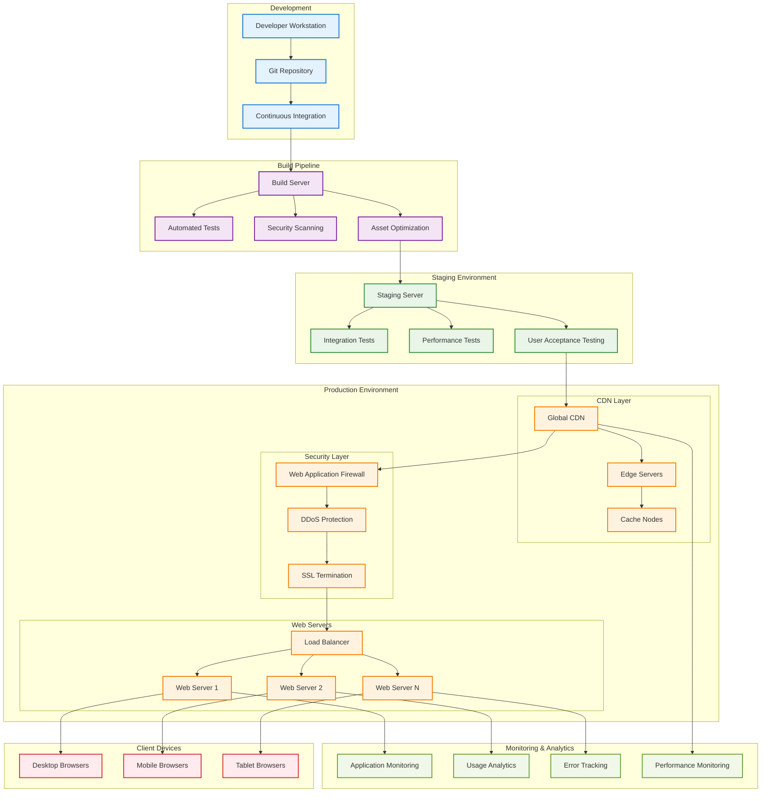

# CYBER SECURIVOX - SYSTEM IMPLEMENTATION DIAGRAMS

## 📋 SYSTEM IMPLEMENTATION OVERVIEW

This document contains comprehensive system implementation diagrams showing the development, build, deployment, and runtime architecture of the Cyber Securivox platform.

---

## 🛠️ 1. IMPLEMENTATION ARCHITECTURE DIAGRAM

### **Purpose:** Complete development to deployment pipeline

```mermaid
graph TB
    subgraph "Development Environment"
        subgraph "Development Tools"
            VSCode[Visual Studio Code]
            Git[Git Version Control]
            Browser[Browser DevTools]
            NPM[NPM Package Manager]
        end
        
        subgraph "Source Code Structure"
            HTML[HTML5 Files]
            CSS[CSS3 + Tailwind]
            JS[JavaScript ES6+ Modules]
            Assets[Static Assets]
        end
    end
    
    subgraph "Build & Deployment Pipeline"
        subgraph "Build Process"
            Minify[Code Minification]
            Optimize[Asset Optimization]
            Bundle[Module Bundling]
            Compress[Gzip Compression]
        end
        
        subgraph "Quality Assurance"
            Lint[Code Linting]
            Test[Unit Testing]
            Validate[HTML/CSS Validation]
            Audit[Security Audit]
        end
    end
    
    subgraph "Production Environment"
        subgraph "Web Server"
            HTTP[HTTP Server]
            HTTPS[HTTPS/SSL]
            CDN[Content Delivery Network]
            Cache[Browser Caching]
        end
        
        subgraph "Client Runtime"
            Browser_Runtime[Modern Browser]
            JS_Engine[JavaScript Engine]
            DOM[DOM Manipulation]
            Storage[Local Storage]
        end
    end
    
    subgraph "External Dependencies"
        subgraph "Libraries"
            Tailwind[Tailwind CSS]
            FontAwesome[FontAwesome Icons]
            D3JS[D3.js Visualization]
            TopoJSON[TopoJSON Data]
        end
        
        subgraph "APIs"
            Canvas_API[Canvas API]
            Fetch_API[Fetch API]
            File_API[File System API]
            Crypto_API[Web Crypto API]
        end
    end
    
    subgraph "Security Implementation"
        subgraph "Client-Side Security"
            CSP[Content Security Policy]
            CORS[CORS Headers]
            Encryption[Client-Side Encryption]
            Validation[Input Validation]
        end
        
        subgraph "Data Protection"
            LocalEnc[Local Storage Encryption]
            NoServer[No Server Data Transfer]
            Privacy[Privacy-First Design]
            Secure[Secure Algorithms]
        end
    end
    
    %% Development Flow
    VSCode --> HTML
    VSCode --> CSS
    VSCode --> JS
    Git --> VSCode
    Browser --> VSCode
    
    %% Build Flow
    HTML --> Minify
    CSS --> Minify
    JS --> Bundle
    Assets --> Optimize
    
    Minify --> Validate
    Bundle --> Lint
    Optimize --> Test
    
    %% Deployment Flow
    Validate --> HTTP
    Lint --> HTTPS
    Test --> CDN
    Audit --> Cache
    
    %% Runtime Flow
    HTTP --> Browser_Runtime
    HTTPS --> JS_Engine
    CDN --> DOM
    Cache --> Storage
    
    %% Dependencies
    Tailwind --> CSS
    FontAwesome --> HTML
    D3JS --> JS
    TopoJSON --> JS
    
    Canvas_API --> JS_Engine
    Fetch_API --> JS_Engine
    File_API --> JS_Engine
    Crypto_API --> JS_Engine
    
    %% Security Implementation
    CSP --> HTTP
    CORS --> HTTPS
    Encryption --> JS_Engine
    Validation --> DOM
    
    LocalEnc --> Storage
    NoServer --> Privacy
    Secure --> Encryption
    
    %% Styling
    classDef development fill:#e3f2fd,stroke:#1976d2,stroke-width:2px
    classDef build fill:#f3e5f5,stroke:#7b1fa2,stroke-width:2px
    classDef production fill:#e8f5e8,stroke:#388e3c,stroke-width:2px
    classDef external fill:#fff3e0,stroke:#f57c00,stroke-width:2px
    classDef security fill:#ffebee,stroke:#d32f2f,stroke-width:2px
    
    class VSCode,Git,Browser,NPM,HTML,CSS,JS,Assets development
    class Minify,Optimize,Bundle,Compress,Lint,Test,Validate,Audit build
    class HTTP,HTTPS,CDN,Cache,Browser_Runtime,JS_Engine,DOM,Storage production
    class Tailwind,FontAwesome,D3JS,TopoJSON,Canvas_API,Fetch_API,File_API,Crypto_API external
    class CSP,CORS,Encryption,Validation,LocalEnc,NoServer,Privacy,Secure security
```

### **Implementation Phases:**
- **Development:** Code creation with modern tools and version control
- **Build & QA:** Optimization, testing, and quality assurance
- **Production:** Deployment with security and performance features
- **Runtime:** Client-side execution with browser APIs

---

## 🔧 2. COMPONENT ARCHITECTURE DIAGRAM

### **Purpose:** Detailed view of system components and their interactions

```mermaid
graph TB
    subgraph "Frontend Application"
        subgraph "UI Components"
            Header[Header Component]
            Navigation[Navigation Component]
            Dashboard[Dashboard Component]
            ModuleCards[Module Cards Component]
            ProgressBars[Progress Bars Component]
            Notifications[Notification Component]
        end
        
        subgraph "Security Module Components"
            HabitComponent[Habit Tracker Component]
            LinkComponent[Link Checker Component]
            PasswordComponent[Password Tester Component]
            ChatComponent[CyberCoach Component]
            LearnComponent[Learning Center Component]
            ScanComponent[Security Scanner Component]
            StegoComponent[Steganography Component]
            NewsComponent[News Component]
            MapComponent[Attack Map Component]
        end
        
        subgraph "Utility Components"
            Router[Router Component]
            StateManager[State Manager]
            EventBus[Event Bus]
            StorageManager[Storage Manager]
            CryptoUtils[Crypto Utilities]
            ValidationUtils[Validation Utilities]
        end
        
        subgraph "Visualization Components"
            D3Wrapper[D3.js Wrapper]
            ChartComponents[Chart Components]
            MapRenderer[Map Renderer]
            ProgressVisuals[Progress Visualizations]
        end
    end
    
    subgraph "Data Layer"
        subgraph "Storage Systems"
            LocalStorageAPI[Local Storage API]
            SessionStorageAPI[Session Storage API]
            IndexedDBAPI[IndexedDB API]
            FileSystemAPI[File System API]
        end
        
        subgraph "Data Models"
            UserModel[User Model]
            HabitModel[Habit Model]
            ScanModel[Scan Result Model]
            ProgressModel[Progress Model]
            NewsModel[News Model]
            AttackModel[Attack Model]
        end
    end
    
    subgraph "External Services"
        subgraph "Browser APIs"
            CanvasAPI[Canvas API]
            FetchAPI[Fetch API]
            CryptoAPI[Web Crypto API]
            NotificationAPI[Notification API]
        end
        
        subgraph "External Data"
            NewsFeeds[News RSS Feeds]
            GeoDataSources[Geographic Data]
            ThreatFeeds[Threat Intelligence]
        end
    end
    
    %% UI Component Connections
    Header --> Navigation
    Dashboard --> ModuleCards
    Dashboard --> ProgressBars
    Navigation --> Router
    
    %% Module Component Connections
    HabitComponent --> StateManager
    LinkComponent --> ValidationUtils
    PasswordComponent --> CryptoUtils
    ChatComponent --> StateManager
    LearnComponent --> ProgressVisuals
    ScanComponent --> ValidationUtils
    StegoComponent --> CryptoUtils
    NewsComponent --> EventBus
    MapComponent --> D3Wrapper
    
    %% Utility Connections
    Router --> StateManager
    StateManager --> StorageManager
    EventBus --> Notifications
    StorageManager --> LocalStorageAPI
    StorageManager --> SessionStorageAPI
    
    %% Visualization Connections
    D3Wrapper --> MapRenderer
    ChartComponents --> ProgressVisuals
    MapRenderer --> CanvasAPI
    
    %% Data Model Connections
    StateManager --> UserModel
    StateManager --> HabitModel
    StateManager --> ScanModel
    StateManager --> ProgressModel
    StateManager --> NewsModel
    StateManager --> AttackModel
    
    %% External Service Connections
    StegoComponent --> CanvasAPI
    NewsComponent --> FetchAPI
    CryptoUtils --> CryptoAPI
    Notifications --> NotificationAPI
    
    NewsComponent --> NewsFeeds
    MapComponent --> GeoDataSources
    NewsComponent --> ThreatFeeds
    
    %% Styling
    classDef ui fill:#e3f2fd,stroke:#1976d2,stroke-width:2px
    classDef modules fill:#f3e5f5,stroke:#7b1fa2,stroke-width:2px
    classDef utilities fill:#e8f5e8,stroke:#388e3c,stroke-width:2px
    classDef visualization fill:#fff3e0,stroke:#f57c00,stroke-width:2px
    classDef data fill:#ffebee,stroke:#d32f2f,stroke-width:2px
    classDef external fill:#f1f8e9,stroke:#689f38,stroke-width:2px
    
    class Header,Navigation,Dashboard,ModuleCards,ProgressBars,Notifications ui
    class HabitComponent,LinkComponent,PasswordComponent,ChatComponent,LearnComponent,ScanComponent,StegoComponent,NewsComponent,MapComponent modules
    class Router,StateManager,EventBus,StorageManager,CryptoUtils,ValidationUtils utilities
    class D3Wrapper,ChartComponents,MapRenderer,ProgressVisuals visualization
    class LocalStorageAPI,SessionStorageAPI,IndexedDBAPI,FileSystemAPI,UserModel,HabitModel,ScanModel,ProgressModel,NewsModel,AttackModel data
    class CanvasAPI,FetchAPI,CryptoAPI,NotificationAPI,NewsFeeds,GeoDataSources,ThreatFeeds external
```

### **Component Categories:**
- **UI Components:** User interface elements and layouts
- **Security Modules:** 9 specialized security tool components
- **Utilities:** Common services and helper functions
- **Visualization:** D3.js and chart rendering components
- **Data Layer:** Storage systems and data models
- **External Services:** Browser APIs and external data sources

---

## 🔄 3. DEPLOYMENT ARCHITECTURE DIAGRAM

### **Purpose:** Production deployment and infrastructure

### **Deployment Features:**
- **Automated CI/CD Pipeline:** From development to production
- **Multi-stage Testing:** Unit, integration, performance, and UAT
- **Global CDN Distribution:** Fast content delivery worldwide
- **Security Layers:** WAF, DDoS protection, SSL termination
- **Load Balancing:** Multiple web servers for scalability
- **Comprehensive Monitoring:** Application, performance, and error tracking

---

## 📊 4. TECHNOLOGY STACK DIAGRAM

### **Purpose:** Complete technology stack and dependencies

```mermaid
graph TB
    subgraph "Frontend Technologies"
        subgraph "Core Technologies"
            HTML5[HTML5]
            CSS3[CSS3]
            JavaScript[JavaScript ES6+]
            WebAPIs[Web APIs]
        end
        
        subgraph "Frameworks & Libraries"
            TailwindCSS[Tailwind CSS]
            FontAwesome[FontAwesome Icons]
            D3js[D3.js Visualization]
            TopoJSON[TopoJSON Geographic Data]
        end
        
        subgraph "Browser APIs"
            LocalStorage[Local Storage API]
            SessionStorage[Session Storage API]
            Canvas[Canvas API]
            Fetch[Fetch API]
            FileSystem[File System API]
            WebCrypto[Web Crypto API]
        end
    end
    
    subgraph "Development Tools"
        subgraph "Code Editors"
            VSCode[Visual Studio Code]
            Extensions[VS Code Extensions]
        end
        
        subgraph "Version Control"
            Git[Git]
            GitHub[GitHub]
        end
        
        subgraph "Build Tools"
            NPM[NPM]
            Webpack[Webpack]
            Babel[Babel]
            ESLint[ESLint]
        end
    end
    
    subgraph "Security Technologies"
        subgraph "Client-Side Security"
            CSP[Content Security Policy]
            HTTPS[HTTPS/TLS]
            CORS[CORS Headers]
            SRI[Subresource Integrity]
        end
        
        subgraph "Data Protection"
            Encryption[AES Encryption]
            Hashing[SHA-256 Hashing]
            PBKDF2[PBKDF2 Key Derivation]
            SecureRandom[Secure Random Generation]
        end
    end
    
    subgraph "Performance Technologies"
        subgraph "Optimization"
            Minification[Code Minification]
            Compression[Gzip Compression]
            LazyLoading[Lazy Loading]
            Caching[Browser Caching]
        end
        
        subgraph "Monitoring"
            WebVitals[Core Web Vitals]
            PerformanceAPI[Performance API]
            ErrorBoundaries[Error Boundaries]
            Analytics[Usage Analytics]
        end
    end
    
    %% Technology Relationships
    HTML5 --> TailwindCSS
    CSS3 --> TailwindCSS
    JavaScript --> D3js
    JavaScript --> TopoJSON
    
    JavaScript --> LocalStorage
    JavaScript --> Canvas
    JavaScript --> Fetch
    JavaScript --> WebCrypto
    
    VSCode --> Extensions
    Git --> GitHub
    NPM --> Webpack
    NPM --> Babel
    NPM --> ESLint
    
    HTTPS --> CSP
    HTTPS --> CORS
    JavaScript --> Encryption
    JavaScript --> Hashing
    
    JavaScript --> Minification
    CSS3 --> Compression
    JavaScript --> LazyLoading
    
    %% Styling
    classDef frontend fill:#e3f2fd,stroke:#1976d2,stroke-width:2px
    classDef development fill:#f3e5f5,stroke:#7b1fa2,stroke-width:2px
    classDef security fill:#e8f5e8,stroke:#388e3c,stroke-width:2px
    classDef performance fill:#fff3e0,stroke:#f57c00,stroke-width:2px
    
    class HTML5,CSS3,JavaScript,WebAPIs,TailwindCSS,FontAwesome,D3js,TopoJSON,LocalStorage,SessionStorage,Canvas,Fetch,FileSystem,WebCrypto frontend
    class VSCode,Extensions,Git,GitHub,NPM,Webpack,Babel,ESLint development
    class CSP,HTTPS,CORS,SRI,Encryption,Hashing,PBKDF2,SecureRandom security
    class Minification,Compression,LazyLoading,Caching,WebVitals,PerformanceAPI,ErrorBoundaries,Analytics performance
```

### **Technology Categories:**
- **Frontend Technologies:** Core web technologies and modern frameworks
- **Development Tools:** Code editors, version control, and build tools
- **Security Technologies:** Client-side security and data protection
- **Performance Technologies:** Optimization and monitoring tools

### **Key Features:**
- **Modern Web Standards:** HTML5, CSS3, ES6+ JavaScript
- **Professional Development:** VS Code, Git, NPM ecosystem
- **Security-First:** Multiple layers of client-side security
- **Performance Optimized:** Comprehensive optimization and monitoring
