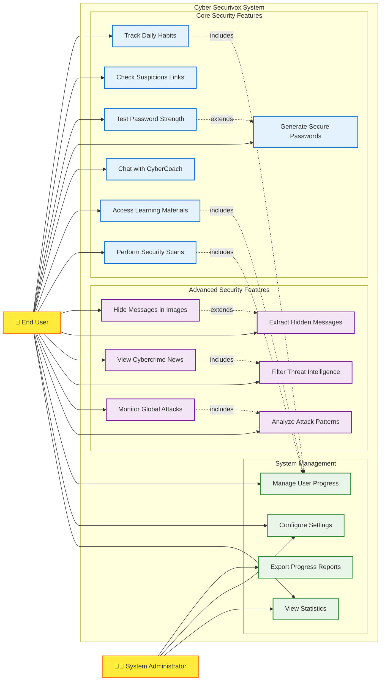
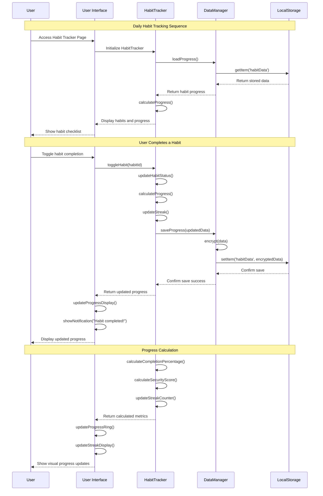
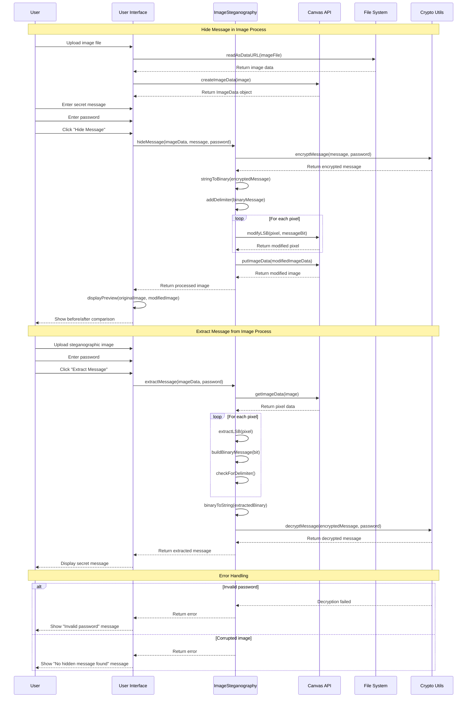
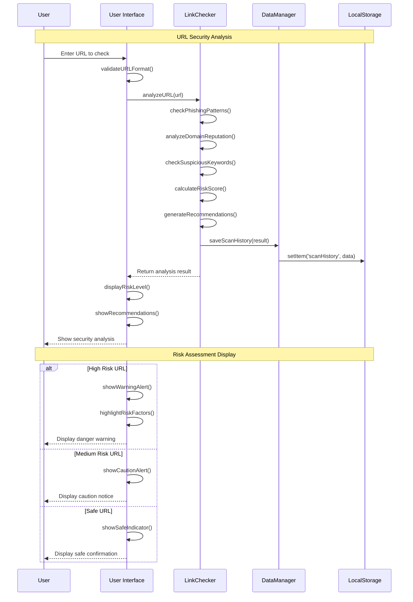

# CYBER SECURIVOX - UML DIAGRAMS

## 📋 UML DIAGRAM COLLECTION

This document contains all UML diagrams for the Cyber Securivox cybersecurity education platform, following UML 2.0 standards and best practices.

---

## 🎯 1. USE CASE DIAGRAM

### **Purpose:** Shows all user interactions and system functionality

### **Actors:**
- **End User:** Primary user accessing all security tools and educational content
- **System Administrator:** Manages platform configuration and generates reports

### **Use Case Categories:**
- **Core Security Features:** Essential daily security tools (7 use cases)
- **Advanced Security Features:** Specialized tools for advanced users (6 use cases)
- **System Management:** Administrative and progress tracking (4 use cases)

### **Relationships:**
- **Include:** Progress management is included in habit tracking, learning, and scanning
- **Extend:** Password generation extends testing; message extraction extends hiding

---

## 🏗️ 2. CLASS DIAGRAM

### **Purpose:** Shows the object-oriented structure and relationships

```mermaid
classDiagram
    class CyberSecurivox {
        -currentUser: User
        -moduleInstances: Array
        -globalSettings: Object
        +init(): void
        +setupMobileMenu(): void
        +showNotification(message: string): void
        +getStoredData(key: string): Object
        +saveData(key: string, data: Object): void
    }
    
    class SecurityTool {
        <<abstract>>
        #name: string
        #description: string
        #isActive: boolean
        +initialize(): void
        +execute(): void
        +saveProgress(): void
        +loadProgress(): void
    }
    
    class HabitTracker {
        -habits: Array~Habit~
        -currentStreak: number
        -completionPercentage: number
        -securityScore: number
        +loadHabits(): void
        +toggleHabit(habitId: string): void
        +calculateProgress(): Object
        +updateStreak(): void
        +getWeeklyData(): Array
    }
    
    class LinkChecker {
        -scanHistory: Array~ScanResult~
        -riskPatterns: Array~Pattern~
        -suspiciousKeywords: Array~string~
        +analyzeURL(url: string): ScanResult
        +checkPhishingPatterns(url: string): boolean
        +generateReport(result: ScanResult): string
        +saveScanHistory(result: ScanResult): void
    }
    
    class PasswordTester {
        -strengthCriteria: Object
        -commonPasswords: Array~string~
        -entropyCalculator: EntropyCalculator
        +testPassword(password: string): PasswordResult
        +calculateStrength(password: string): number
        +generatePassword(options: Object): string
        +checkCommonPassword(password: string): boolean
    }
    
    class CyberCoach {
        -knowledgeBase: Array~QAPair~
        -chatHistory: Array~Message~
        -responseTemplates: Object
        +processQuery(query: string): string
        +generateResponse(query: string): string
        +updateHistory(message: Message): void
        +searchKnowledge(keywords: Array): Array
    }
    
    class LearningCenter {
        -lessons: Array~Lesson~
        -userProgress: Object
        -completionStatus: Array~boolean~
        -certificates: Array~Certificate~
        +loadLessons(): void
        +trackProgress(lessonId: string): void
        +generateCertificate(courseId: string): Certificate
        +getRecommendations(): Array~Lesson~
    }
    
    class SecurityScanner {
        -scanResults: Array~SecurityResult~
        -recommendations: Array~Recommendation~
        -securityChecks: Array~SecurityCheck~
        +performScan(): SecurityResult
        +analyzeSettings(): Object
        +generateReport(): string
        +getPrioritizedRecommendations(): Array
    }
    
    class ImageSteganography {
        -imageData: ImageData
        -secretMessage: string
        -password: string
        -algorithm: string
        +hideMessage(image: File, message: string, password: string): ImageData
        +extractMessage(image: File, password: string): string
        +validateImage(image: File): boolean
        +encryptMessage(message: string, password: string): string
    }
    
    class CybercrimeNews {
        -newsArticles: Array~NewsArticle~
        -categories: Array~Category~
        -filters: Object
        -lastUpdate: Date
        +fetchNews(): Promise~Array~
        +filterByCategory(category: string): Array
        +searchArticles(query: string): Array
        +updateFeed(): void
    }
    
    class CyberAttackMap {
        -attackData: Array~Attack~
        -mapProjection: Object
        -attackTypes: Object
        -statistics: Object
        +initializeMap(): void
        +animateAttack(attack: Attack): void
        +updateStatistics(): void
        +filterAttacks(type: string): Array
        +generateAttackData(): Attack
    }
    
    class DataManager {
        -localStorage: Storage
        -sessionStorage: Storage
        -encryptionKey: string
        +save(key: string, data: Object): boolean
        +load(key: string): Object
        +encrypt(data: string): string
        +decrypt(data: string): string
        +clearData(): void
    }
    
    class Habit {
        +id: string
        +title: string
        +description: string
        +points: number
        +completed: boolean
        +completionDate: Date
    }
    
    class ScanResult {
        +url: string
        +riskLevel: string
        +score: number
        +factors: Array~string~
        +timestamp: Date
        +recommendations: Array~string~
    }
    
    class PasswordResult {
        +score: number
        +strength: string
        +feedback: Array~string~
        +entropy: number
        +crackTime: string
    }
    
    class Attack {
        +id: string
        +type: string
        +source: Location
        +target: Location
        +timestamp: Date
        +severity: number
    }
    
    %% Inheritance Relationships
    SecurityTool <|-- HabitTracker
    SecurityTool <|-- LinkChecker
    SecurityTool <|-- PasswordTester
    SecurityTool <|-- CyberCoach
    SecurityTool <|-- LearningCenter
    SecurityTool <|-- SecurityScanner
    SecurityTool <|-- ImageSteganography
    SecurityTool <|-- CybercrimeNews
    SecurityTool <|-- CyberAttackMap
    
    %% Composition Relationships
    CyberSecurivox *-- SecurityTool
    CyberSecurivox *-- DataManager
    HabitTracker *-- Habit
    LinkChecker *-- ScanResult
    PasswordTester *-- PasswordResult
    CyberAttackMap *-- Attack
    
    %% Association Relationships
    SecurityTool --> DataManager : uses
    HabitTracker --> DataManager : stores progress
    LinkChecker --> DataManager : stores history
    PasswordTester --> DataManager : stores results
    CyberCoach --> DataManager : stores chat history
    LearningCenter --> DataManager : stores progress
    SecurityScanner --> DataManager : stores scan results
```

### **Class Hierarchy:**
- **CyberSecurivox:** Main application controller
- **SecurityTool:** Abstract base class for all security modules
- **9 Specialized Classes:** Each security module extends SecurityTool
- **Data Classes:** Habit, ScanResult, PasswordResult, Attack
- **Utility Classes:** DataManager for storage operations

### **Design Patterns:**
- **Template Method:** SecurityTool provides common interface
- **Strategy Pattern:** Different algorithms for each security tool
- **Observer Pattern:** Progress updates across modules
- **Singleton Pattern:** DataManager for centralized storage

---

## 📊 3. SEQUENCE DIAGRAMS

### **A. Habit Tracking Process**

### **B. Image Steganography Process**

### **C. Link Security Analysis Process**

---

## 🔄 4. ACTIVITY DIAGRAMS

### **A. CyberAttack Map Visualization Process**

```mermaid
flowchart TD
    Start([User Opens Attack Map]) --> Init[Initialize Map Module]
    Init --> LoadD3[Load D3.js Library]
    LoadD3 --> LoadTopo[Load TopoJSON World Data]
    LoadTopo --> CreateSVG[Create SVG Container]
    CreateSVG --> SetProjection[Set Map Projection]
    SetProjection --> DrawMap[Draw World Map]
    DrawMap --> InitStats[Initialize Statistics Dashboard]
    InitStats --> StartSim[Start Attack Simulation]

    StartSim --> GenAttack[Generate Random Attack]
    GenAttack --> SelectSource[Select Source Location]
    SelectSource --> SelectTarget[Select Target Location]
    SelectTarget --> SelectType[Select Attack Type]
    SelectType --> CreatePath[Create Attack Path]
    CreatePath --> AnimatePath[Animate Attack Trajectory]

    AnimatePath --> ShowExplosion[Show Explosion Effect]
    ShowExplosion --> UpdateStats[Update Live Statistics]
    UpdateStats --> UpdateCounters[Update Attack Counters]
    UpdateCounters --> UpdateThreat[Update Threat Level]
    UpdateThreat --> AddToFeed[Add to Recent Attacks Feed]

    AddToFeed --> CheckPause{Is Simulation Paused?}
    CheckPause -->|No| Delay[Wait Random Interval]
    CheckPause -->|Yes| WaitResume[Wait for Resume]

    Delay --> GenAttack
    WaitResume --> CheckResume{Resume Clicked?}
    CheckResume -->|Yes| GenAttack
    CheckResume -->|No| WaitResume

    %% User Interactions
    StartSim --> UserInteraction{User Interaction?}
    UserInteraction -->|Pause| PauseBtn[Pause Button Clicked]
    UserInteraction -->|Reset| ResetBtn[Reset Button Clicked]
    UserInteraction -->|Filter| FilterBtn[Filter Button Clicked]
    UserInteraction -->|Zoom| ZoomAction[Zoom/Pan Action]
    UserInteraction -->|None| Continue[Continue Simulation]

    PauseBtn --> TogglePause[Toggle Pause State]
    TogglePause --> CheckPause

    ResetBtn --> ClearMap[Clear All Attacks]
    ClearMap --> ResetStats[Reset All Statistics]
    ResetStats --> ResetCounters[Reset Counters to Zero]
    ResetCounters --> ClearFeed[Clear Recent Attacks Feed]
    ClearFeed --> GenAttack

    FilterBtn --> ApplyFilter[Apply Attack Type Filter]
    ApplyFilter --> UpdateDisplay[Update Map Display]
    UpdateDisplay --> GenAttack

    ZoomAction --> UpdateProjection[Update Map Projection]
    UpdateProjection --> RedrawMap[Redraw Map Elements]
    RedrawMap --> GenAttack

    Continue --> GenAttack

    %% Error Handling
    LoadD3 --> CheckD3{D3.js Loaded?}
    CheckD3 -->|No| ShowError[Show Loading Error]
    CheckD3 -->|Yes| LoadTopo

    LoadTopo --> CheckTopo{TopoJSON Loaded?}
    CheckTopo -->|No| UseFallback[Use Fallback Map]
    CheckTopo -->|Yes| CreateSVG

    UseFallback --> CreateSimpleMap[Create Simple Continent Shapes]
    CreateSimpleMap --> InitStats

    ShowError --> End([Error State])

    %% Styling
    classDef startEnd fill:#4caf50,stroke:#2e7d32,stroke-width:3px,color:#fff
    classDef process fill:#2196f3,stroke:#1565c0,stroke-width:2px,color:#fff
    classDef decision fill:#ff9800,stroke:#ef6c00,stroke-width:2px,color:#fff
    classDef userAction fill:#9c27b0,stroke:#6a1b9a,stroke-width:2px,color:#fff
    classDef error fill:#f44336,stroke:#c62828,stroke-width:2px,color:#fff

    class Start,End startEnd
    class Init,LoadD3,LoadTopo,CreateSVG,SetProjection,DrawMap,InitStats,StartSim,GenAttack,SelectSource,SelectTarget,SelectType,CreatePath,AnimatePath,ShowExplosion,UpdateStats,UpdateCounters,UpdateThreat,AddToFeed,Delay,WaitResume,ClearMap,ResetStats,ResetCounters,ClearFeed,ApplyFilter,UpdateDisplay,UpdateProjection,RedrawMap,Continue,UseFallback,CreateSimpleMap process
    class CheckPause,CheckResume,UserInteraction,CheckD3,CheckTopo decision
    class PauseBtn,ResetBtn,FilterBtn,ZoomAction,TogglePause userAction
    class ShowError error
```

